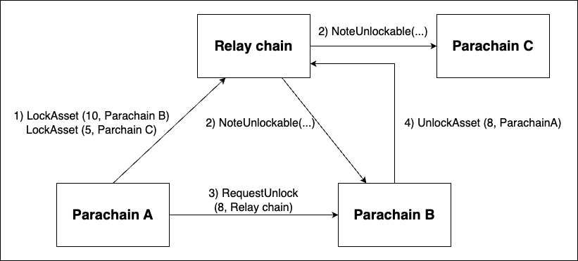

# Locking
Xcm enables the locking of assets, meaning the restriction of the transfer or withdrawal of assets on a chain. 
The XCM locking mechanism consists of four instructions: `LockAsset`, `UnlockAsset`, `NoteUnlockable`, and `RequestUnlock`. 
Let's explore each instruction in detail:

## LockAsset
```rust,noplayground 
LockAsset { asset: MultiAsset, unlocker: MultiLocation }
```
The LockAsset instruction is used to lock locally held assets and prevent further transfers or withdrawals. 
This instruction requires two parameters:

- `asset`: The asset(s) to be locked.
- `unlocker`: The MultiLocation that can unlock the asset(s). This value must match the origin of a corresponding `UnlockAsset` instruction to unlock the asset.

When the locking operation succeeds, a `NoteUnlockable` instruction is sent to the unlocker. 
This instruction serves as a notification that the asset is now unlockable.

## UnlockAsset
```rust,noplayground 
UnlockAsset { asset: MultiAsset, target: MultiLocation }
```
The `UnlockAsset` instruction removes the lock on a specific asset on the local chain, allowing it to be transferred if there are no other restrictions. 
The following parameters are required:

- `asset`: The asset to be unlocked.
- `target`: The owner of the asset on the local chain.


## NoteUnlockable
```rust,noplayground 
NoteUnlockable { asset: MultiAsset, owner: MultiLocation }
```
The `NoteUnlockable` instruction indicates that an asset has been locked on the system which the message originated from.  
The locked assets can only be unlocked by receiving an `UnlockAsset` instruction from this chain.
This instruction requires the following parameters:

- `asset`: The asset(s) which are now unlockable from this origin.
- `owner`: The owner of the asset on the chain in which it was locked. This may be a location specific to the origin network.

It is essential to trust the origin to have locked the corresponding asset before sending this message.


## RequestUnlock
```rust, noplayground
RequestUnlock { asset: MultiAsset, locker: MultiLocation }
```
The `RequestUnlock` instruction is used to send an `UnlockAsset` instruction to the `locker` for a given asset. 
The following parameters are required:

- `asset`: The asset(s) to be unlocked.
- `locker`: The location from which a previous NoteUnlockable was sent, and where the UnlockAsset instruction should be sent.


## Example
To get a better grasp on how these instructions work together, we give two examples in this section. 
The examples use the xcm-executor with the pallet-xcm as the implementation for the `AssetLocker` xcm-executor config item. 
An important note of this implementation is that only one lock with ID `py/xcmlk` is set per account. 
The pallet-xcm implementation keeps track of all the xcm-related locks that are placed on an account and sets the most restricting one with the `py/xcmlk` lock ID. 
This principle becomes more clear in the second example.


### Example 1
Check out the full [example code](TODO).
The scenario of this example is as follows:

Parachain A locks 5 Cents of relay chain native assets of its Sovereign account on the relay chain and assigns Parachain B as unlocker.
Parachain A then asks Parachain B to unlock the funds partly. 
Parachain B responds by sending an UnlockAssets instruction to the relay chain.


1. send `LockAsset` instruction from ParaA to relay. 
```rust,noplayground
ParaA::execute_with(|| {
    let message = Xcm(vec![LockAsset {
        asset: (Here, AMOUNT * 5).into(),
        unlocker: (Parachain(2)).into(),
    }]);
    assert_ok!(ParachainPalletXcm::send_xcm(Here, Parent, message.clone()));
});
```

2. Parachain B receives this NoteUnlockable instruction from the relay chain.
```rust,noplayground
NoteUnlockable {
    owner: (Parent, Parachain(1)).into(),
    asset: (Parent, AMOUNT * 5).into()
}
```

3. Parachain A sends RequestUnlock instruction to Parachain B
```rust,noplayground
ParaA::execute_with(|| {
    let message = Xcm(vec![RequestUnlock {
        asset: (Parent, 3 * AMOUNT).into(),
        locker: Parent.into(),
    }]);
    assert_ok!(ParachainPalletXcm::send_xcm(Here, (Parent, Parachain(2)), message.clone()));
});
```

4. Parachain B sends an UnlockAsset instruction to the relay chain. We check if the lock is updated accordingly:
```rust,noplayground
assert_eq!(
    relay_chain::Balances::locks(&parachain_sovereign_account_id(1)),
    vec![BalanceLock { id: *b"py/xcmlk", amount: 2 * AMOUNT, reasons: Reasons::All }]
);
```


### Example 2

Check out the full [example code](TODO).
The scenario of this example is as follows:

Parachain A sets two locks on the relay chain with as unlockers Parachain B and Parachain C.
Parachain A then requests Parachain B to partly unlock.

Note: The locks overlap.



1. Set locks on the relay chain. Unlockers: B, C; Locks registered in pallet-xcm: 10, 5. Lock set in pallet-balances: 10.

```rust, noplayground
ParaA::execute_with(|| {
    let message = Xcm(vec![
        LockAsset { asset: (Here, AMOUNT * 10).into(), unlocker: (Parachain(2)).into() },
        LockAsset { asset: (Here, AMOUNT * 5).into(), unlocker: (Parachain(3)).into() },
    ]);
    assert_ok!(ParachainPalletXcm::send_xcm(Here, Parent, message.clone()));
});

Relay::execute_with(|| {
    assert_eq!(
        relay_chain::Balances::locks(&parachain_sovereign_account_id(1)),
        vec![BalanceLock { id: *b"py/xcmlk", amount: AMOUNT * 10, reasons: Reasons::All }]
    );
});
```

2. Parachain B and C receive the `NoteUnlockable` instruction.
```rust, noplayground
ParaB::execute_with(|| {
    assert_eq!(
        parachain::MsgQueue::received_dmp(),
        vec![Xcm(vec![NoteUnlockable {
            owner: (Parent, Parachain(1)).into(),
            asset: (Parent, AMOUNT * 10).into()
        }])]
    );
});

ParaC::execute_with(|| {
    assert_eq!(
        parachain::MsgQueue::received_dmp(),
        vec![Xcm(vec![NoteUnlockable {
            owner: (Parent, Parachain(1)).into(),
            asset: (Parent, AMOUNT * 5).into()
        }])]
    );
});
```

3. Parachain A sends a `RequestUnlock` instruction to Parachain B for 8 CENTS.
```rust, noplayground
ParaA::execute_with(|| {
    let message = Xcm(vec![RequestUnlock {
        asset: (Parent, 8 * AMOUNT).into(),
        locker: Parent.into(),
    }]);

    assert_ok!(ParachainPalletXcm::send_xcm(Here, (Parent, Parachain(2)), message.clone()));
});
```

4. Parachain B Unlocks a part of the funds by sending a UnlockAsset to the relay chain. Check the lock in the balances-pallet. 
Unlockers: B, C; Funds registered in pallet-xcm: 2, 5. 
Lock set in pallet-balances: 5.

```rust,noplayground
Relay::execute_with(|| {
    assert_eq!(
        relay_chain::Balances::locks(&parachain_sovereign_account_id(1)),
        vec![BalanceLock { id: *b"py/xcmlk", amount: 5 * AMOUNT, reasons: Reasons::All }]
    );
});
```