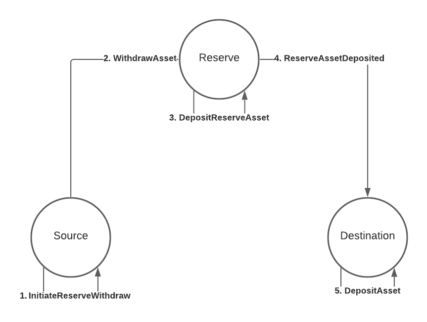
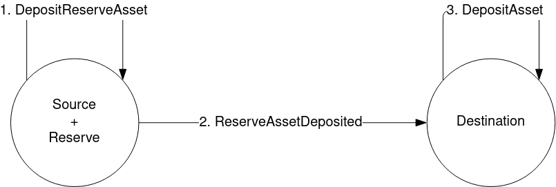

# Reserve-backed transfers

For consensus systems that don't have the level of trust required for asset teleportation, they can instead opt for trusting a third party called a reserve to store the real assets (think Kusama's relay chain or Statemine, or Polkadot's relay or Statemint).
The source and the destination need a way to keep track of the real assets they own on the reserve, this is usually done by minting a new derivative token.
Both source and destination now need accounts on the reserve to hold their assets, we call these their sovereign accounts on that system.

## Process



The flow in this diagram is further explained below:

### 1. InitiateReserveWithdraw

The source gathers the derivative assets to be transferred from the sending account and burns them, taking note of the amount of derivatives that were burned.

### 2. WithdrawAsset

The source sends a `WithdrawAsset` instruction to the reserve, instructing it to withdraw real assets equivalent to the amount of derivatives burned from the source chain.

### 3. DepositReserveAsset

The reserve deposits the assets withdrawn from the previous step to the destination's sovereign account, taking note of the amount of assets deposited.

### 4. ReserveAssetDeposited

The reserve creates a `ReserveAssetDeposited` instruction with the amount of assets deposited to the destination's sovereign account, and sends this instruction onwards to the destination.
The destination receives the instruction and processes it, minting the correct amount of derivative assets.

### 5. DepositAsset

The destination deposits the derivative assets minted to the receiving account.

### Thoughts

The addition of a third consensus system is already a hint of the disadvantages of a reserve asset transfer model.
Firstly, the reserve could easily become a point of centralization when too many consensus systems rely on it to be the reserve of choice for their assets.
Secondly, the sheer amount of steps required necessarily makes it more prone to errors, and as such, implementors will have to consider more possible pitfalls and provide technical support accordingly when an end user encounters issues arising from these steps.
Last, but not least, either the source or destination can opt to designate multiple consensus systems to be their reserves.
In such a situation, care must be taken in order to ensure that the sovereign accounts on the reserves are balanced, so that one doesn't get drained while the others still contain a healthy balance.

## Example

We'll create a program for the scenario in the diagram.
Let's assume that the reserve is a relay chain and both source and destination are parachains 1 and 2 respectively.
Let's also say that an account ALICE in parachain 1 wants to transfer the relay chain's native token to their other account (also ALICE) on parachain 2.
The program might look like this:

```rust,noplayground
let message = Xcm(vec![
  WithdrawAsset((Parent, amount).into()),
  InitiateReserveWithdraw {
    assets: All.into(),
    reserve: Parent.into(),
    xcm: Xcm(vec![DepositReserveAsset {
      assets: All.into(),
      dest: Parachain(2).into(),
      xcm: Xcm(vec![DepositAsset {
        assets: All.into(),
        beneficiary: AccountId32 { id: ALICE.into(), network: None }.into(),
      }]),
    }]),
  },
]);
```

This program should be executed on the source, so on parachain 1.
We start, as usual, with a `WithdrawAsset` instruction.
The `MultiAsset` here references the relay chain's native token, which means we'll be gathering the derivative on this chain.

### InitiateReserveWithdraw

```rust,noplayground
InitiateReserveWithdraw { assets: MultiAssetFilter, reserve: MultiLocation, xcm: Xcm<()> }
```

The `InitiateReserveWithdraw` instruction takes the derivative token from the holding register and burns it.
Then it sends a new XCM to the specified `reserve`, in this example, the relay chain.
This new XCM contains the following instructions, in order:
1. WithdrawAsset
2. ClearOrigin
3. All instructions specified in the `xcm` operand, in this case `DepositReserveAsset`

As was the case with [teleports](../teleports.md), instructions 1. and 2. are added automatically by the executor when using `InitiateReserveWithdraw`.

Upon receiving this XCM, the reserve will withdraw the asset from parachain 1's sovereign account (where the real asset is stored), and deposit it on parachain 2's sovereign account.

### DepositReserveAsset

```rust,noplayground
DepositReserveAsset { assets: MultiAssetFilter, dest: MultiLocation, xcm: Xcm<()> }
```

This instruction is used in this example instead of `DepositAsset`, because as well as depositing the assets to parachain 2's sovereign account, this instruction will send another XCM to parachain 2.
This new XCM has the following instructions:
1. ReserveAssetDeposited
2. ClearOrigin
3. All instructions specified in the `xcm` operand, in this case, only `DepositAsset`

### ReserveAssetDeposited

```rust,noplayground
ReserveAssetDeposited(MultiAssets)
```

Parachain 2 receives the XCM, mints new derivative tokens and deposit them locally to the beneficiary account.
`ReserveAssetDeposited` is a *trusted indication*.
As is the case with teleporting, you need to trust the reserve to have actually put the specified amount of assets in the sovereign account of this system.
You can specify which systems you trust as reserves for which assets by configuring the [IsReserve](TODO:add_link) type in the executor.
In our example, both parachains trust the relay chain as a reserve for its own native token.

## Another example

We now know this type of transfers requires 3 actors: the source, the reserve, and the destination.
However, the source and reserve don't have to be different systems, they could be one and the same, as in the following diagram.



In this case the message is the following:

```rust,noplayground
let message = Xcm(vec![
  WithdrawAsset((Parent, amount).into()),
  DepositReserveAsset {
    assets: All.into(),
    dest: Parachain(2).into(),
    xcm: Xcm(vec![DepositAsset {
      assets: All.into(),
      beneficiary: AccountId32 { id: ALICE.into(), network: None }.into(),
    }]),
  },
]);
```

This simplifies the reserve-backed transfer.
However, the destination still needs to:
- Recognize the source as the proper reserve for the tokens that are being sent over and
- Support minting derivatives of the tokens being sent over

It's also possible to skip the `WithdrawAsset` instruction.
The `TransferReserveAsset` instruction handles the withdrawal already.
It can be called like so:

```rust,noplayground
let message = Xcm(vec![
  TransferReserveAsset {
    assets: (Parent, amount).into(),
    dest: Parachain(2).into(),
    xcm: Xcm(vec![DepositAsset {
      assets: All.into(),
      beneficiary: AccountId32 { id: ALICE.into(), network: None }.into(),
    }]),
  },
]);
```

## Next steps

Next, we'll talk about a very important topic we mentioned before but skipped in this chapter, paying fees for the effects our XCMs have.
